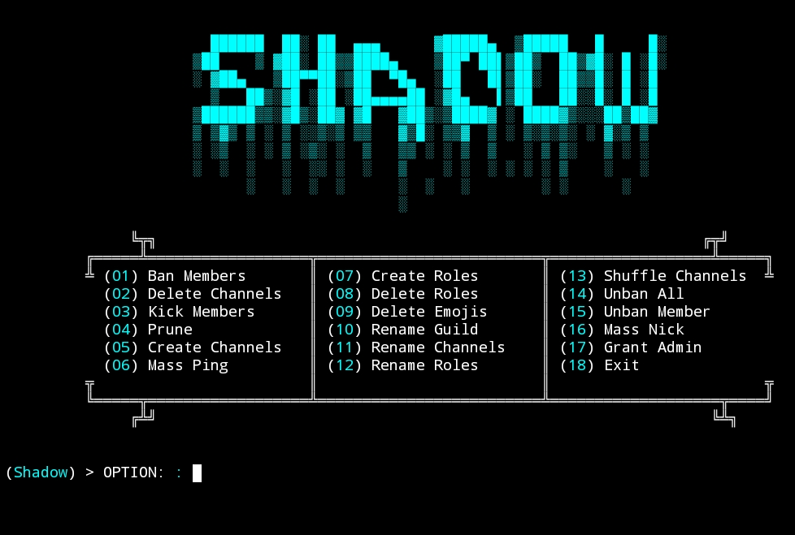

# Shadow-Nuker
A Discord Nuke Tool Made In Python

# Preview


# Features
1. Ban All
2. Kick All
3. Prune
4. Create Channels
5. Delete Channels
6. Rename Channels
7. Shuffle Channels
8. Create Role
9. Delete Role
10. Rename Role
11. Mass Ping
12. Get Admin
13. Unban All
14. Unban Member
15. Mass Nick
16. Rename Guild
17. Delete Emojis

# Installation
```
git clone https://github.com/yup-console/Shadow-Nuker
cd Shadow-Nuker
pip install -r requirements.txt
[Edit config.json]
python shadow.py
```

# Important 
If you got this error :
```
(Shadow) Guild ID: 1398298009443504310
(-) Client.run() got an unexpected keyword argument 'bot'
```
Change Line 800
From This :
```py
__client__.run(token, bot=True)
```
To This :
```py
__client__.run(token)
```
# Disclaimer
This script is educational and fully coded by yup-console aka @console.fy in discord if you choose to abuse this tool it's are your fault and yup-console will not accept anything about you'r mistake.
